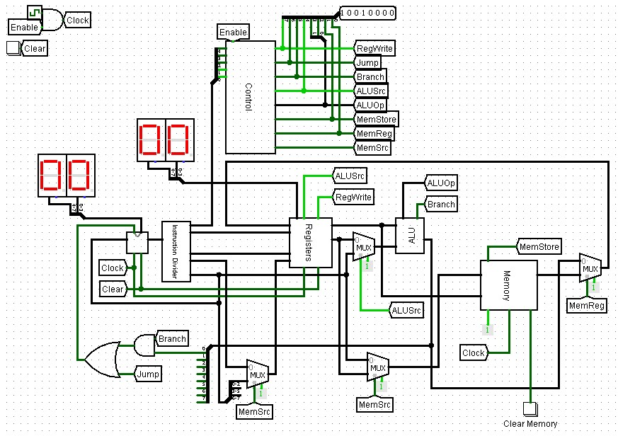
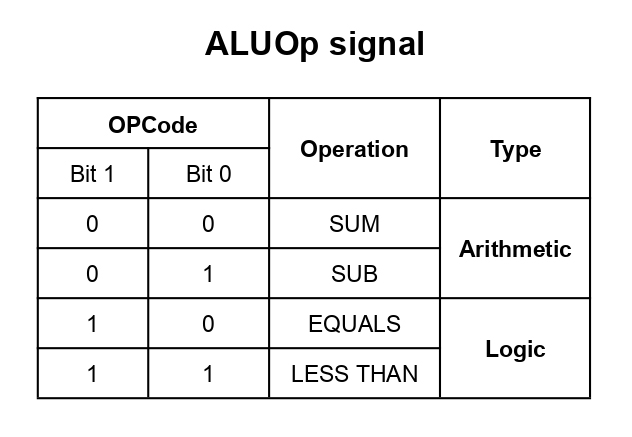

# ID RMN 0 Processor

> **Meaning:** Instruction Driven Registor Manipulator Number 0.

This project aims to implement the operation of a single cycle MIPS processor, for this purpose, logisim 2.7.x was used, which can be found both in this repository and in the download link below:
[download link](https://sourceforge.net/projects/circuit/files/latest/download)

# How to use

use the documentation that will be presented below to create an algorithm using the set of instructions provided by our processor.  When you have an algorithm completed, save it with any extension (.ramon, it was the extension used in the pre-ready algorithms available), use python 3.10.x or higher ([Python download](https://www.python.org/downloads/)) in the `main.py` file in the asemple folder going through  parameter the code you made.

## Example:
having the test.txt file, open a terminal of your choice and run `main.py` as follows:

    py main.py test.txt

A .hex file with the same name will be generated in the same folder as the original file.
With the `processor.circ` circuit open in logisim, open the `Instruction Memory` and load the .hex file in the circuit ROM .
> **How to load the file in ROM:** right click on the ROM > edit contents > open... > select the file.

After loading the algorithm in ROM memory, just choose a frequency *(1Hz by default)*, enable the clock in the main circuit and watch the magic happen.
> **Displays:** There are two displays on the main screen, on the left we have the address of the instruction that is currently being executed and on the right we have the value of the $rd register that is being used.
## Pre-made algorithms
If you don't want to program, there is a pre-made algorithm that finds the largest element of a vector, this is saved in the assemble folder with the name `findBigger.ramon`, just load it in the ROM as shown above and have fun.
# Imagens
## Main circuit

main circuit, responsible for uniting all the sub circuits specialized in specific tasks.
## Instruction Memory

this circuit is responsible for storing all the instructions of the algorithm, at each clock, a new instruction is loaded and executed.
## Registers

this circuit is responsible for storing the bank of registers.
> **Names:** they are numbered from 0 to 7, being necessary to specify them in the codes as *$r0, $r1, ... $r7*.
## ALU

this circuit is responsible for performing the arithmetic and logical operations.
## Memory

The RAM memory used by the SW and LW instructions, it is in this memory that values are saved and read at specific addresses.
> **Adresses:** This memory is addressed from 0 to 254, with 255 being the last address, but reserved for the number 0.

# Documentation
## **Instruction type table**

This table shows the formats of implemented instructions and which values are used in each type.
## **Signal descriptions**

This table describes all the control signals that come from the control circuit.
## **Instruction set**

This table presents all the details about the instructions implemented in the processor, such as the type, OpCode, a brief description and an example of how to use it.
## **Instruction codes**

This table shows the code that will be sent to the control unit for each instruction.
## **Instruction signal**

This table shows the control unit output for each of the opcodes shown above.
## **ALUOp signal**

This table shows which values correspond to each operation performed on the ALU

# Download
You can download project clone repository with link http `https://github.com/IMayanLP/16bit-processor.git`, ssh `git@github.com:IMayanLP/16bit-processor.git`, or by [clicking here](https://github.com/IMayanLP/16bit-processor/archive/refs/heads/master.zip)